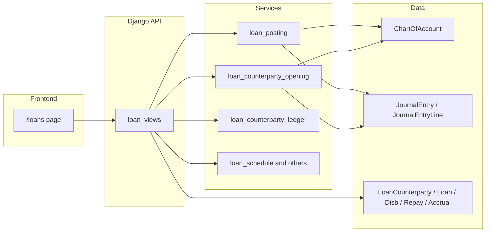

# Loan module ()

This document describes the **loans and financing** feature: counterparties, loan facilities, disbursements, repayments, interest accrual, general-ledger posting, and the main UI. It is accurate for the codebase layout under `backend/api` and `frontend/src/app/loans`.

## Overview

- **Counterparties** (`LoanCounterparty`) represent banks, individuals, or other parties. They can carry an **opening loan position** (receivable or payable) that posts to the GL once.
- **Loans** (`Loan`) are facilities (borrowed or lent) tied to a counterparty, with **principal**, **settlement (bank/cash)**, and optional **interest** and **interest accrual** chart lines.
- **All automated money movement** is recorded as posted **`JournalEntry` / `JournalEntryLine`** rows, using the same engine as the rest of the ERP (`_create_posted_entry` in `api/services/gl_posting.py`).

## High-level data flow

## Key files

| Area | Path |
|------|------|
| HTTP API (all loan routes) | `backend/api/views/loan_views.py` |
| GL: disburse, repay, accrual, reversals | `backend/api/services/loan_posting.py` |
| GL: counterparty opening balance | `backend/api/services/loan_counterparty_opening.py` |
| Party sub-ledger JSON | `backend/api/services/loan_counterparty_ledger.py` |
| Amort / schedule | `backend/api/services/loan_schedule.py` |
| Day-count / interest basis | `backend/api/services/loan_interest_basis.py` |
| Business-line / quarterly helpers | `backend/api/services/loan_business_line.py` |
| Islamic labels / behaviour | `backend/api/services/loan_islamic.py` |
| Shared GL primitive | `backend/api/services/gl_posting.py` (`_create_posted_entry`) |
| URL registration | `backend/api/urls.py` (paths under `loans/...`) |
| Domain models | `backend/api/models.py` (`LoanCounterparty`, `Loan`, `LoanDisbursement`, `LoanRepayment`, `LoanInterestAccrual`) |
| Main UI | `frontend/src/app/loans/page.tsx` |
| GL account activity / COA statement lines | `backend/api/services/journal_statement.py` |

## REST API (base: `/api`)

All loan endpoints are company-scoped (same auth / `company_id` pattern as the rest of the app).

| Method | Path | Purpose |
|--------|------|--------|
| GET, POST | `loans/counterparties/` | List or create counterparty |
| GET, PUT, DELETE | `loans/counterparties/<id>/` | Counterparty detail, update, delete |
| GET | `loans/counterparties/<id>/ledger/` | Sub-ledger: opening + loan events |
| GET, POST | `loans/` | List or create loan |
| GET, PUT, DELETE | `loans/<id>/` | Loan detail, update, delete |
| POST | `loans/<id>/disburse/` | Post disbursement (+ GL) |
| POST | `loans/<id>/repay/` | Post repayment (+ GL) |
| POST | `loans/<id>/repayments/<rid>/reverse/` | Reverse repayment |
| GET | `loans/schedule-preview/` | Schedule preview (query/body per view) |
| GET | `loans/<id>/schedule-remaining/` | Remaining schedule |
| GET | `loans/<id>/statement/` | Loan statement |
| GET | `loans/<id>/interest-hint/` | Interest calculation hint |
| POST | `loans/<id>/accrue-interest/` | Accrue interest |
| POST | `loans/<id>/accruals/<aid>/reverse/` | Reverse accrual |

## Domain model (summary)

- **`LoanCounterparty`**: `company`, `code`, `name`, `role_type`, `party_kind`, optional `customer_id` / `vendor_id` / `employee_id`, opening balance fields, `opening_principal_account_id`, `opening_equity_account_id`, `opening_balance_journal_id` (after GL post).
- **`Loan`**: `counterparty`, `direction` (borrowed vs lent), `principal_account`, `settlement_account`, optional `interest_account`, `interest_accrual_account`, `banking_model`, `product_type`, Islamic parent/child for facilities/deals, amounts and dates, etc.
- **`LoanDisbursement`**, **`LoanRepayment`**, **`LoanInterestAccrual`**: link to `Loan`, amounts, optional `journal_entry` / reversal links.

## General ledger integration

- Posting uses **`JournalEntry`** with `is_posted=True` and balanced lines on **`ChartOfAccount`**.
- **Idempotency** is enforced by **entry number** patterns, for example (see `loan_posting.py` and `loan_counterparty_opening.py`):
  - `AUTO-LOAN-DISP-<disbursement_id>` — disbursement
  - `AUTO-LOAN-REPAY-<repayment_id>` — repayment
  - `AUTO-LOAN-CP-OB-<counterparty_id>` — counterparty opening balance
  - Accrual / reversal patterns are defined in `loan_posting.py`
- **Disbursement (typical):**
  - **Borrowed:** Dr settlement, Cr principal (payable).
  - **Lent:** Dr principal (receivable), Cr settlement.
- **Counterparty opening (typical):**
  - **Receivable:** Dr principal (e.g. 1160), Cr Opening Balance Equity (e.g. 3200).
  - **Payable:** Dr OBE, Cr principal (e.g. 2410).

### Default chart lines (seed migration)

`backend/api/migrations/0016_loan_module_default_coa.py` seeds per company, when missing, lines such as:

- `1160` — Loans Receivable — Principal  
- `2410` — Loans Payable — Principal  
- `4410` / `6620` — interest income / expense (optional use)

Built-in **2410** is usually **`account_type: loan`**, not `liability`—so it appears under the **Loan** grouping on the chart of accounts UI.

## Frontend

- **Route:** `/loans` — implemented in `frontend/src/app/loans/page.tsx`.
- Loads `GET /loans/`, `GET /loans/counterparties/`, and `GET /chart-of-accounts/` (for GL pickers) among others.
- Supports counterparty create/edit, loan create/edit, disburse, repay, schedule tools, interest accrual, reversals, statements, and CSV/print for party ledger where implemented.

## Counterparty opening vs customer A/R

- Opening balance posts to the **selected principal account** (default 1160 or 2410) and **Opening Balance Equity**—not to **Accounts Receivable** from sales.
- Linking a **Customer** (or vendor/employee) on the counterparty is for **reference**; it does not merge loan principal with invoice A/R unless you also book those business events separately.

## Islamic / product variants

- `loan_islamic.py` and flags on `Loan` / API responses drive wording and some journal **descriptions** (e.g. financing vs loan). **Posting mechanics** remain the same double-entry structure.

## Related reports and COA

- **Chart of accounts** and **account statement** (`/chart-of-accounts/<id>/statement/`) read **`JournalEntryLine`** activity; they are the place to see each line’s effect on 2410/1160, including `journal_description` and `entry_number` when present (see `journal_statement.py`).

## Tests

- `backend/tests/test_loan_api_integration.py` — HTTP-level loan flows.  
- `backend/tests/test_loan_islamic.py` — Islamic-related cases.

## Migrations (evolution)

Not exhaustive: `0014_loan_management`, `0016_loan_module_default_coa`, `0017`–`0021` loan field tweaks, `0039_loan_counterparty_opening_ledger`, etc. Inspect `backend/api/migrations/` for the full history.

---

*Generated for developers working on FSERP. For API details (request/response JSON), read the handlers in `loan_views.py` and serializers/logic in the services listed above.*
